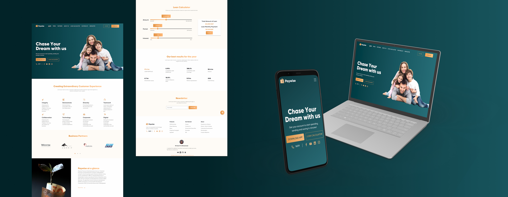

# Paywise

Modern bank landing page, dashboard coming soon.

### 🔗 Links

- [Live Site](https://paywise-55367.web.app/)
- [Source Repo](https://github.com/MuhammadM1998/Paywise)

### ‍💻 Project Stack

Feedback is always appreciated 📝🙏
